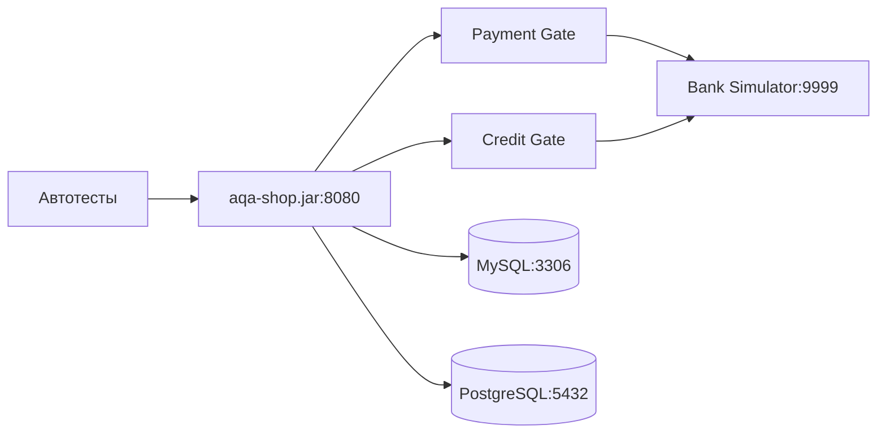

# «Автоматизация тестирования веб-сервиса, взаимодействующего с СУБД и API Банка»

[](https://github.com/levvolkov/tour-pay-gateway-tests/actions) &nbsp; [](https://levvolkov.github.io/tour-pay-gateway-tests/documentation/allure-report) &nbsp; [](https://levvolkov.github.io/tour-pay-gateway-tests/documentation/allure-report) &nbsp; [](https://levvolkov.github.io/tour-pay-gateway-tests/documentation/allure-report) &nbsp; [](https://github.com/levvolkov/tour-pay-gateway-tests/issues)

<br>

## 📌 О проекте

**Автоматизированное тестирование веб-сервиса для покупки туров:**
- **Обычная оплата** по дебетовой карте
- **Кредитование** по данным банковской карты

**Технологии:**

[](https://java.com) &nbsp;
[](https://gradle.org) &nbsp;
[](https://selenide.org) &nbsp;
[](https://junit.org/junit5/) &nbsp;
[](https://docs.qameta.io/allure/) &nbsp;
[](https://github.com/features/actions)

**Инструменты:**

[](https://jetbrains.com/idea) &nbsp;
[](https://docker.com) &nbsp;
[](https://developer.chrome.com/docs/devtools/) &nbsp;
[](https://dbeaver.io)

## 🛠 Техническая архитектура


## 📂 Структура проекта
```Copy
tour-pay-gateway-tests/
├── artifacts/aqa-shop.jar      # Тестируемый веб-сервис
├── documentation               # Документация
├── gate-simulator/             # Эмулятор банка
├── src/
│   └── test/java/              # Автотесты (UI + DB + API)
├── application.properties      # Конфигурация для подключения к СУБД и банковским сервисам
├── build.gradle                # Файл конфигурации Gradle с зависимостями для Selenide, JUnit, Allure и др.
└── docker-compose.yml          # Контейнеры MySQL + PostgreSQL + Bank Simulator
```

## 📜 Документация
- [План автоматизации](documentation/plan.md)
- [Отчёт по итогам тестировании](documentation/report.md)
- [Отчет по итогам автоматизации](documentation/summary.md)

## 🚀 Процедура запуска автотестов
1. **Клонируйте и откройте проект в IDEA:**
```bash
git clone https://github.com/levvolkov/tour-pay-gateway-tests.git
```

2. **Запустите Docker Desktop и выполните:**
```bash
# Соберет контейнеры MySQL, PostgreSQL, Bank Simulator
docker compose up -d  

# Для запуска приложение на MySQL СУБД
java "-Dspring.datasource.url=jdbc:mysql://localhost:3306/app" -jar artifacts/aqa-shop.jar

# Для запуска приложение на PostgreSQL СУБД
java "-Dspring.datasource.url=jdbc:postgresql://localhost:5432/app" -jar artifacts/aqa-shop.jar
```

3. **Запустите автотесты:**
```bash
# Для MySQL:
./gradlew clean test "-Ddb.url=jdbc:mysql://localhost:3306/app" 

# Для PostgreSQL:
./gradlew clean test "-Ddb.url=jdbc:postgresql://localhost:5432/app"

# Для API тестов (если необходимо отдельно)
./gradlew clean test --tests GateSimulatorApiTest

# Просмотр Allure-отчёта:
./gradlew allureServe
```

**Ошибка запуска приложения: если порт занят**
```bash
# Найти PID процесса, использующий порт:
lsof -i :8080

# Принудительное завершение с помощью флага -9:
kill -9 <PID>
```